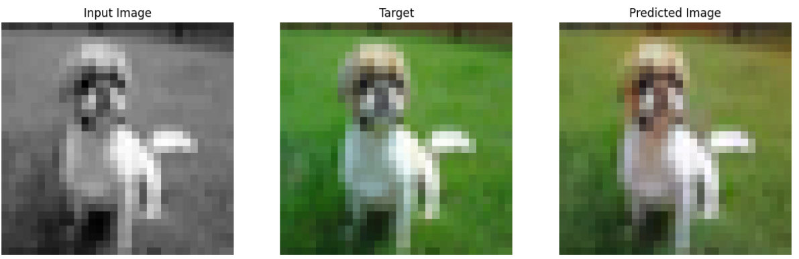

# **Colorizing Grayscale Images Using Wasserstein GAN**

## **Introduction**
Colorization of grayscale images has been a topic of interest in computer vision. The task involves using machine learning to learn how to transform black-and-white inputs into a colorized, realistic output. In this project, we make use of the Wasserstein GAN, a modification to the generative adversarial network. This model was trained using the CIFAR-10 dataset [[1]](https://www.cs.toronto.edu/~kriz/learning-features-2009-TR.pdf). The generator model, making use of a U-Net architecture, and the discriminator model, making use of a PatchGAN discriminator, were both inspired from the Tensorflow pix2pix implementation [[2]](https://www.tensorflow.org/tutorials/generative/pix2pix)
### **Generative Adversarial Networks** 
Generative adversarial networks, or GANs, are a class of generative AI model making use of two separate neural networks: a "generator" and a "discriminator." The generator tries to generate data similar to some other input data. In this case, the generator is given grayscale images, and its goal is to create realistic colorizations of the inputs. The discriminator attempts to distinguish between the real data and the data synthesized by the generator. These two neural networks train together, with the generator forcing the discriminator to learn the difference between real and fake data, and the discriminator forcing the generator to create more realistic samples.
- **GAN Limitations:** GANs are often limited by issues such as mode collapse, where the generator only produces a very small variety of samples rather than creating realistic data. GANs are also prone to vanishing gradients if the generator or discriminator gets too much better than the other, causing that segment of the network to continuously fail.
### **Wasserstein GAN**
The Wasserstein GAN (WGAN) is a variant of the original generative adversarial network. The modification is in the loss function. In a vanilla GAN, the goal of the discriminator is to maximize the log-likelihood that real samples are classified as real, and minimize the log-likelihood that fake samples are classified as real. The generator's goal is to maximize the log-likelihood that the fake samples are classified as real. In the WGAN, on the other hand, the discriminator aims to minimize the Wasserstein distance, which essentially measures the difference between the distribution of the real images and the distribution of the fake images. The generator aims to maximize the discriminator's output for generated samples, essentially tricking the discriminator into confidently categorizing fake images as real.

   
  WGAN and GAN Loss: <a href = 'https://jonathan-hui.medium.com/gan-wasserstein-gan-wgan-gp-6a1a2aa1b490'>Source</a>

- **Gradient Penalty:** We want our discriminator model to accurately learn to differentiate fake images from real ones. One way to ensure that the discriminator learns in a stable and generalizable manner is to enforce the 1-Lipschitz constraint, essentially that the absolute value of the slope the function models is never greater than one. Using gradient penalty, we can incentivize the model to avoid large positive or negative gradients by adding to the cost function of the discriminator when gradients are too large. We control gradient penalty with a hyperparameter, called LAMBDA_GP in this model.
- **Advantages:** Because the WGAN-GP incentivizes the model to meet the 1-Lipschitz constraint, its training is more stable than the vanilla GAN model. Using the WGAN model also improves sample quality by reducing the chance of mode collapse and improving convergence.

## **Note:**
This README is a work in progress. There will be more details about the model architecture here in the future.

## **Results**
### **After 1 epoch:**

  <table>
    <tr>
      <td>
         
         
         
         
         
      </td>
    </tr>
  </table>

### **After 10 epochs:**

  <table>
    <tr>
      <td>
         
         
         
         
         
      </td>
    </tr>
  </table>

### **After 25 epochs:**

  <table>
    <tr>
      <td>
         
         
         
         
         
      </td>
    </tr>
  </table>

### **After 50 epochs:**

  <table>
    <tr>
      <td>
         
         
         
         
         
         
         
         
         
         
      </td>
    </tr>
  </table>

### **After 100 epochs:**

  <table>
    <tr>
      <td>
         
         
         
         
         
         
         
         
         
         
         
         
         
         
         
         
         
         
         
         
      </td>
    </tr>
  </table>

The CIFAR-10 dataset also contains some grayscale images. The generator model was tested with some of these after 100 epochs:

  <table>
    <tr>
      <td>
         
         
         
         
         
      </td>
    </tr>
  </table>

### **Loss Curves:**
The model was trained for 100 epochs, with each epoch taking 3125 steps with a batch size of 16. Here are the resulting loss curves:

**Discriminator Loss:**
Discriminator loss represents the difference in the distribution of generated images and real images. A WGAN discriminator loss near 0 is most ideal.

   
  Discriminator Loss

 

**L1 Loss:**
L1 loss (also known as Mean Absolute Error) quantifies the difference between the real and predicted images by taking the average distance between real pixels and fake pixels in their image data. An L1 loss closer to 0 represents that the generator is producing images more similar to the real ones.

   
  L1 Loss

## **Citations and Licensing**
[[1]](https://www.cs.toronto.edu/~kriz/learning-features-2009-TR.pdf) Krizhevsky, A., & Hinton, G. (2009). Learning multiple layers of features from tiny images.

[[2]](https://www.tensorflow.org/tutorials/generative/pix2pix) Copyright 2019 The Tensorflow Authors
<pre>
Licensed under the Apache License, Version 2.0 (the "License");

You may not use this file except in compliance with the License.

You may obtain a copy of the License at

  http://www.apache.org/licenses/LICENSE-2.0
